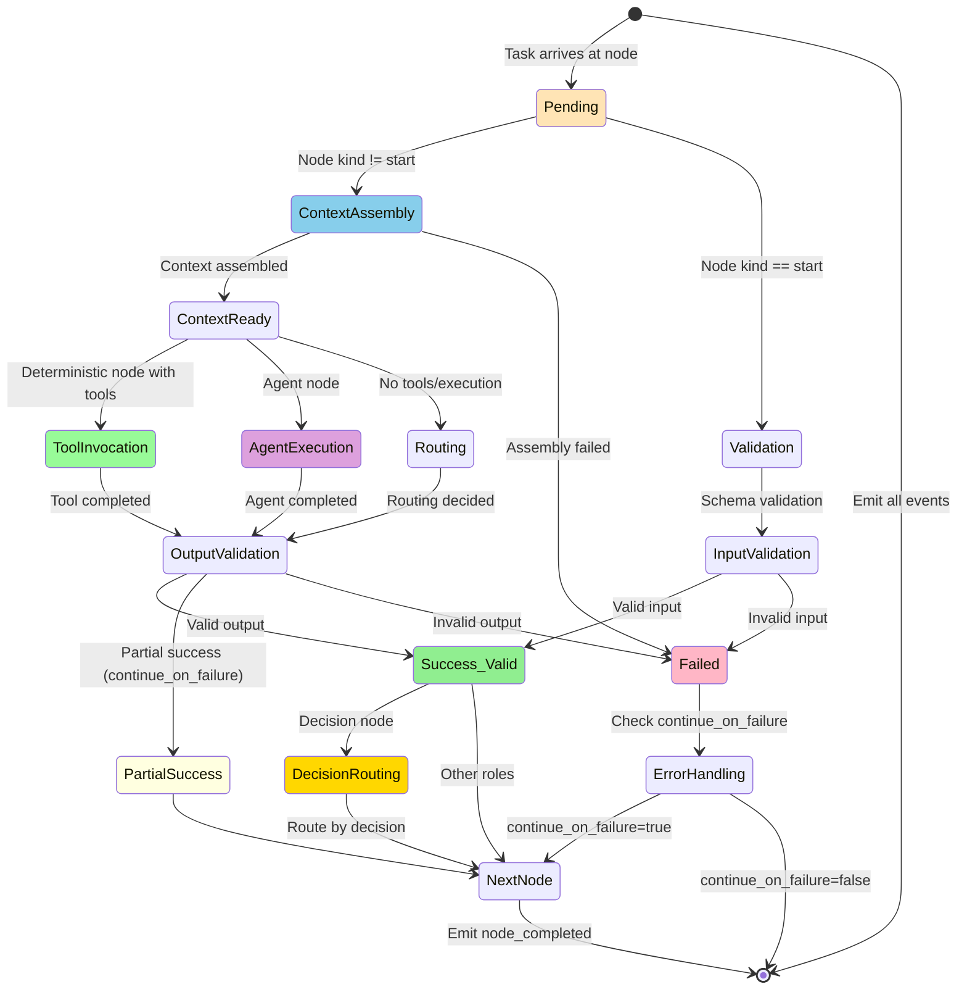
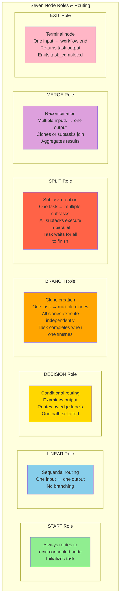
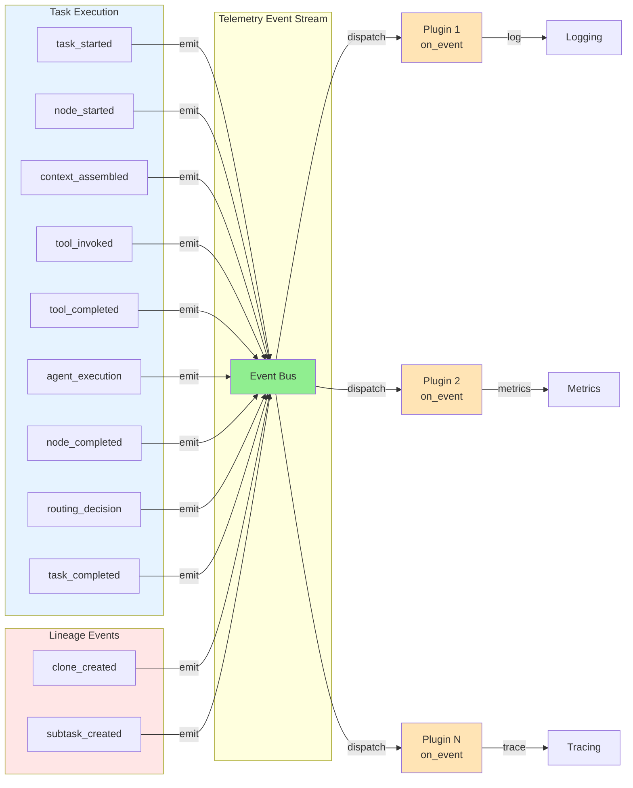
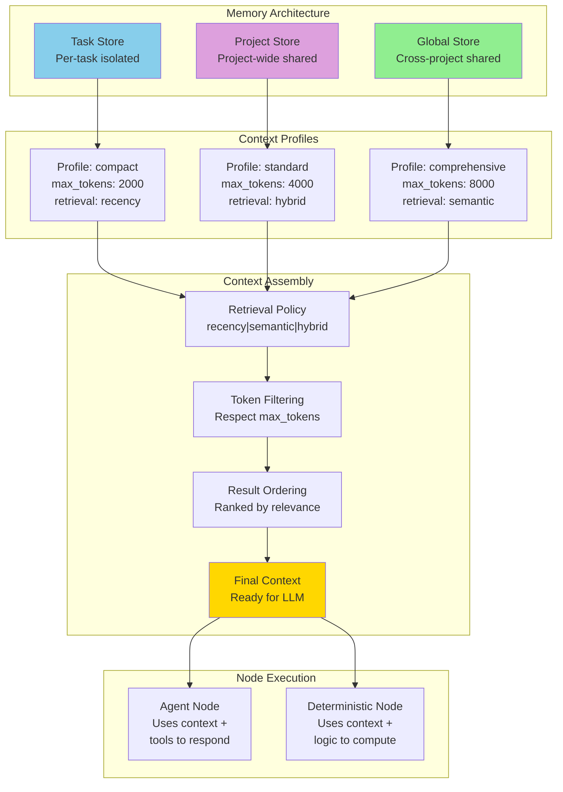
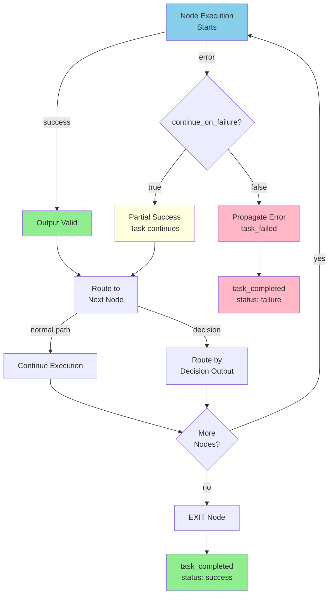

# Agent Engine Architecture

This document describes the complete architecture of Agent Engine, including the core data structures, execution model, routing semantics, and system design.

## Canonical References

The authoritative semantics for every subsystem live in the canonical documents:
- `docs/canonical/AGENT_ENGINE_SPEC.md` – behavioral contract and execution semantics
- `docs/canonical/AGENT_ENGINE_OVERVIEW.md` – architectural overview and motivations
- `docs/canonical/PROJECT_INTEGRATION_SPEC.md` – required manifests and integration rules

Use this architecture doc as an implementation map; consult the canonical files above for the source of truth.

## Table of Contents

1. [Core Concepts](#core-concepts)
2. [DAG Structure](#dag-structure)
3. [Node Lifecycle & State Transitions](#node-lifecycle--state-transitions)
4. [Routing Semantics](#routing-semantics)
5. [Task Lineage](#task-lineage)
6. [Plugin System & Telemetry](#plugin-system--telemetry)
7. [Memory & Context](#memory--context)
8. [Error Handling](#error-handling)

---

## Core Concepts

Agent Engine is a configuration-first orchestration framework that executes workflows as Directed Acyclic Graphs (DAGs). Key concepts:

- **Workflow**: A DAG defined in `workflow.yaml` with nodes and edges
- **Node**: An operation in the workflow (agent-driven or deterministic)
- **Task**: An execution instance of a workflow with input, output, and history
- **Role**: One of seven semantic node types (start, linear, decision, branch, split, merge, exit)
- **Context**: Assembled knowledge base provided to nodes during execution
- **Tool**: Deterministic function invoked by nodes (filesystem, HTTP, compute, etc.)
- **Agent**: LLM-driven operation that can use tools and context

---

## DAG Structure

The DAG is the core execution model. Here's how nodes and edges are organized:

```mermaid
graph LR
    subgraph Workflow["Workflow Structure"]
        direction LR
        S["START<br/>Role: start"]
        L1["Linear Operation<br/>Role: linear"]
        D["Decision<br/>Role: decision"]
        B["Branch<br/>Role: branch"]
        SP["Split<br/>Role: split"]
        M["Merge<br/>Role: merge"]
        E["EXIT<br/>Role: exit"]

        S -->|Edge| L1
        L1 -->|Edge| D
        D -->|yes| B
        D -->|no| SP
        B -->|Clone A| M
        B -->|Clone B| M
        SP -->|Subtask 1| M
        SP -->|Subtask 2| M
        M -->|Merged| E
    end

    subgraph Properties["Node Properties"]
        ID["ID<br/>Unique identifier"]
        Kind["Kind<br/>agent or deterministic"]
        Role["Role<br/>One of seven types"]
        Context["Context<br/>Profile or global"]
        Tools["Tools<br/>Allowed tool IDs"]
        Failure["Failure Policy<br/>continue or fail"]
    end

    Workflow -.->|has| Properties

    style S fill:#90EE90
    style E fill:#FFB6C6
    style D fill:#87CEEB
    style B fill:#FFD700
    style SP fill:#FFD700
    style M fill:#DDA0DD
```



### DAG Invariants

1. **Acyclic**: No cycles allowed; all paths must terminate
2. **Reachable**: Every node must be reachable from at least one START node
3. **Complete**: Every START node must have a path to at least one EXIT node
4. **Role Constraints**:
   - Exactly one START node (default_start=true)
   - Exactly one EXIT node
   - DECISION nodes have multiple outgoing edges with labels
   - BRANCH creates clones; SPLIT creates subtasks
   - MERGE has multiple incoming edges

---

## Node Lifecycle & State Transitions

Each node execution follows a strict lifecycle with defined state transitions:



### State Details

- **Pending**: Node waiting for execution
- **Context Assembly**: Gathering context from memory stores
- **Validation**: Checking input/output against schemas
- **Tool Invocation**: Running deterministic tools
- **Agent Execution**: LLM generating output
- **Routing**: Decision node selecting next path
- **Success/Failed/Partial**: Terminal states for node execution

---

## Routing Semantics

The router implements seven distinct node roles, each with unique routing behavior:



### Detailed Routing Rules

#### START Node
- Single outgoing edge to first processing node
- Initializes task context
- Always succeeds (input validation only)
- No failure handling

#### LINEAR Node
- Single input path, single output path
- Deterministic or agent-driven
- Can use tools and context
- Failure handling applies

#### DECISION Node
- Single input path
- Multiple outgoing edges with labels
- Output determines which edge to follow
- Routed by edge label matching output value
- Only one path selected

#### BRANCH Node
- Single input path
- Creates multiple independent clones
- Each clone executes the complete downstream DAG
- Parent task completes when any clone succeeds
- Clone lineage tracked for observability

#### SPLIT Node
- Single input path
- Creates multiple subtasks with shared parent
- All subtasks must complete
- Results aggregated at MERGE node
- Parent waits for all subtasks to finish

#### MERGE Node
- Multiple input paths (from clones or subtasks)
- Single output path
- Aggregates results from multiple sources
- Deterministic merge logic combines outputs
- Awaits all inputs before proceeding

#### EXIT Node
- Single input path
- Terminates workflow execution
- Returns final task output
- Emits task_completed event
- No further routing

---

## Task Lineage

Tasks can create children through branching and splitting. Lineage is tracked for observability and debuggability:

```mermaid
graph TD
    Parent["Parent Task<br/>task-parent-001"]

    Parent -->|BRANCH| Clone1["Clone 1<br/>Lineage: branch-clone"]
    Parent -->|BRANCH| Clone2["Clone 2<br/>Lineage: branch-clone"]
    Parent -->|BRANCH| Clone3["Clone 3<br/>Lineage: branch-clone"]

    Clone1 -->|executes| DAG1["Downstream DAG"]
    Clone2 -->|executes| DAG2["Downstream DAG"]
    Clone3 -->|executes| DAG3["Downstream DAG"]

    DAG1 -->|completes| Merge["MERGE Node<br/>Recombination"]
    DAG2 -->|completes| Merge
    DAG3 -->|completes| Merge

    Merge -->|aggregates| MergeOut["Merged Output"]

    Parent2["Parent Task<br/>task-parent-002"]
    Parent2 -->|SPLIT| Sub1["Subtask 1<br/>Lineage: split-subtask"]
    Parent2 -->|SPLIT| Sub2["Subtask 2<br/>Lineage: split-subtask"]
    Parent2 -->|SPLIT| Sub3["Subtask 3<br/>Lineage: split-subtask"]

    Sub1 -->|independent| SubDAG1["Subtask DAG"]
    Sub2 -->|independent| SubDAG2["Subtask DAG"]
    Sub3 -->|independent| SubDAG3["Subtask DAG"]

    SubDAG1 -->|finishes| SubMerge["Parallel Completion"]
    SubDAG2 -->|finishes| SubMerge
    SubDAG3 -->|finishes| SubMerge

    SubMerge -->|parent waits| SubMergeOut["Final Output"]

    subgraph BranchSection["BRANCH Pattern"]
        Parent
        Clone1
        Clone2
        Clone3
        DAG1
        DAG2
        DAG3
        Merge
        MergeOut
    end

    subgraph SplitSection["SPLIT Pattern"]
        Parent2
        Sub1
        Sub2
        Sub3
        SubDAG1
        SubDAG2
        SubDAG3
        SubMerge
        SubMergeOut
    end

    style Parent fill:#90EE90
    style Parent2 fill:#90EE90
    style Clone1 fill:#FFA500
    style Clone2 fill:#FFA500
    style Clone3 fill:#FFA500
    style Sub1 fill:#FF6347
    style Sub2 fill:#FF6347
    style Sub3 fill:#FF6347
    style Merge fill:#DDA0DD
    style SubMerge fill:#DDA0DD
```



### Lineage Metadata

Each task carries metadata about its lineage:

```python
{
  "task_id": "task-001",
  "parent_id": None,
  "lineage": {
    "type": None,  # "branch-clone" or "split-subtask"
    "parent_task_id": None,
    "node_id": None,  # Node that created this task
    "position": 0  # Position in clone/subtask list
  }
}
```

---

## Plugin System & Telemetry

The engine emits events throughout execution, which are observed by plugins:



### Event Types

The engine emits the following event categories:

1. **Task Events**: `task_started`, `task_completed`, `task_failed`
2. **Node Events**: `node_started`, `node_completed`, `node_failed`
3. **Tool Events**: `tool_invoked`, `tool_completed`, `tool_failed`
4. **Context Events**: `context_assembled`, `context_failed`
5. **Routing Events**: `routing_decision`, `routing_branch`, `routing_split`, `routing_merge`
6. **Lineage Events**: `clone_created`, `subtask_created`

### Plugin Flow

1. **Engine emits event** → Event object created with metadata
2. **Event Bus receives** → Event stored in event log
3. **Plugin dispatch** → Each registered plugin receives event copy
4. **Plugin processing** → Plugin observes without modifying
5. **Error isolation** → Plugin exceptions logged, don't affect execution

---

## Memory & Context

Memory stores hold knowledge that's assembled into context during node execution:



### Context Assembly Process

1. **Profile Lookup**: Determine which memory stores and policies apply
2. **Retrieval**: Query task/project/global stores using specified policy
3. **Filtering**: Remove items exceeding max_token budget
4. **Ordering**: Rank by recency, semantic similarity, or hybrid score
5. **Injection**: Provide assembled context to node execution

---

## Error Handling

Errors are handled at multiple levels with consistent status propagation:



### Status Propagation Rules

1. **Node succeeds** → Output becomes task output
2. **Node fails, continue_on_failure=false** → Task fails immediately
3. **Node fails, continue_on_failure=true** → Task continues (partial status)
4. **All nodes execute** → Task reaches EXIT node
5. **EXIT node completes** → Task marked success/failure based on final status

---

## System Integration

### Configuration Files

```
project/
├── workflow.yaml          # DAG definition
├── agents.yaml           # LLM configurations
├── tools.yaml            # Tool definitions
├── memory.yaml           # Memory stores & profiles
├── plugins.yaml          # Plugin configurations
├── cli_profiles.yaml     # CLI behavior
└── schemas/              # Optional JSON schemas
```

### Runtime Components

```
Engine
├── DAG                    # Loaded workflow graph
├── Router                 # Routing logic (7 roles)
├── TaskManager            # Task lifecycle + lineage
├── ContextAssembler       # Memory assembly
├── ToolRegistry           # Tool lookup & invocation
├── AdapterRegistry        # LLM provider access
├── EventBus              # Telemetry distribution
├── PluginRegistry        # Plugin management
└── MemoryStores          # Task/project/global stores
```

### Execution Flow

1. **Initialization**: Load config, validate schemas, construct DAG
2. **Task Creation**: Create task from input, assign to start node
3. **Node Loop**: Execute nodes following DAG edges
4. **Context Assembly**: Prepare context for each node
5. **Execution**: Run deterministic tools or invoke LLM agent
6. **Routing**: Determine next node based on node role
7. **Event Dispatch**: Emit events to plugin registry
8. **Completion**: Reach EXIT node, return final task output

---

## Key Principles

1. **Deterministic**: Same input → same execution path + events
2. **Observable**: All operations emit telemetry
3. **Extensible**: Plugins observe without modifying
4. **Safe**: Error handling prevents cascading failures
5. **Traceable**: Full lineage preserved for debugging
6. **Configurable**: YAML-driven, no code changes needed
7. **Typed**: All inputs/outputs validated against schemas

This architecture provides a robust foundation for building complex AI-driven workflows with observability, error handling, and extensibility built in.
